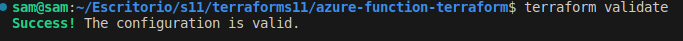
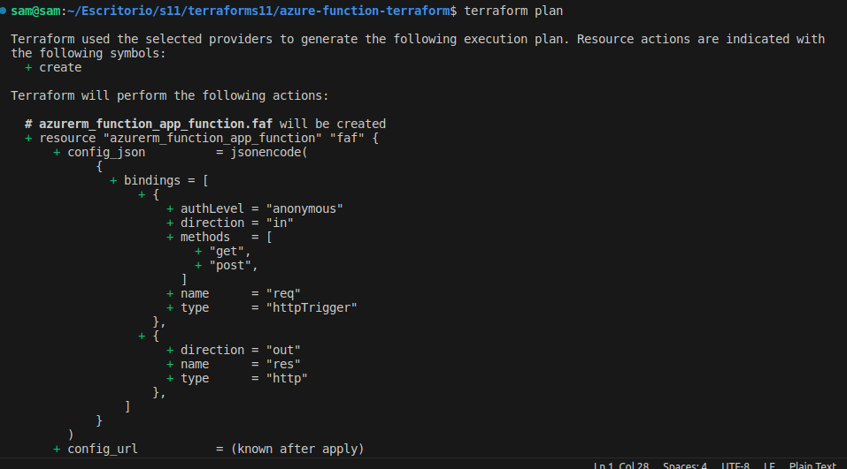
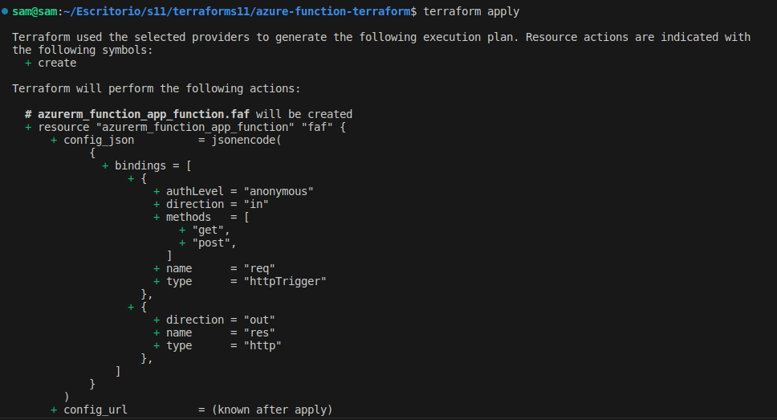
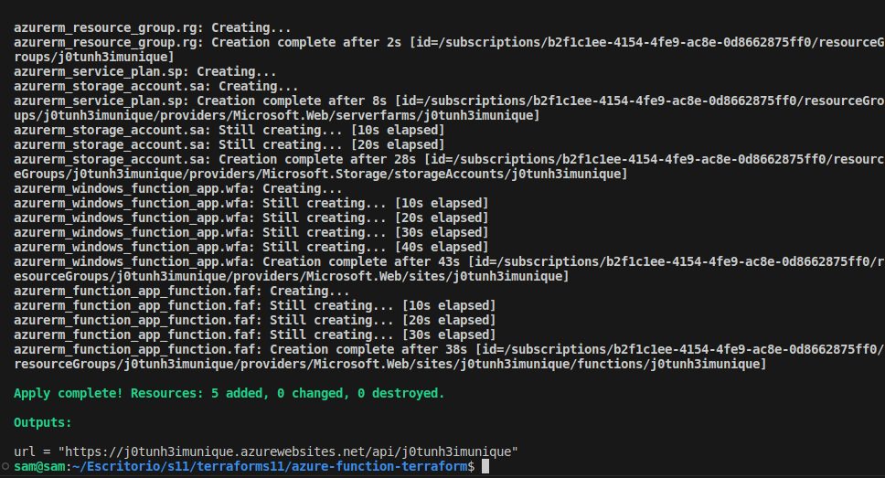
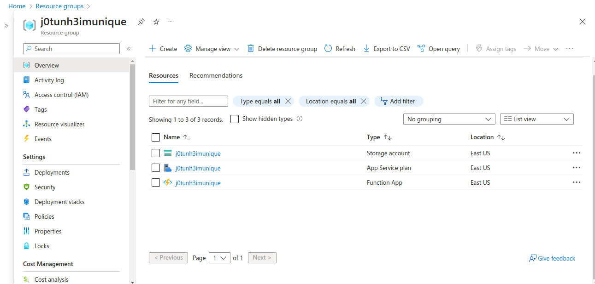
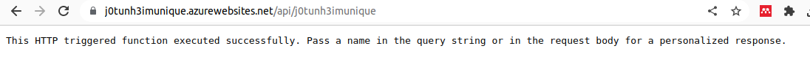
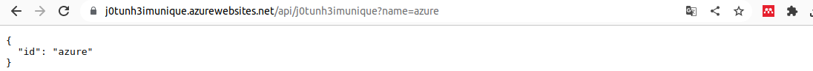
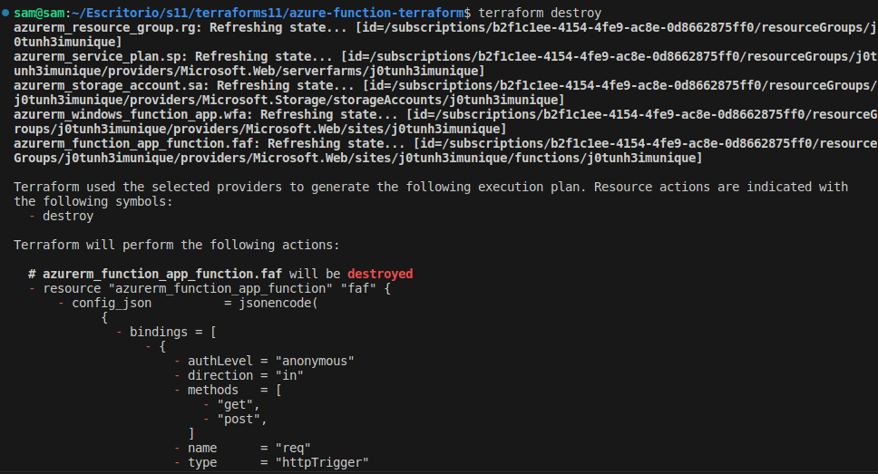
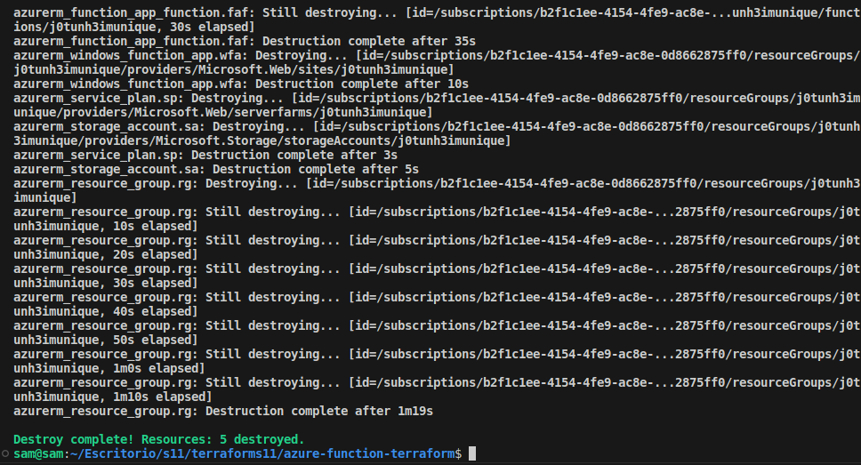

# Azure Function Terraform
El objetivo de esta practica es crear un recurso Azure Function de forma automatizada y desplegar el código de ejemplo.
## terraform init
Con el comando `terraform init` se descarga el provider que se va a ocupar, el cual esta definido en el código.

## terraform validate
Con este comando nos aseguramos de que la sintaxis de los archivos .tf sean correctos.

## terraform plan
Este comando nos permite ver los recursos que se van a crear una vez aplicado el código.

## terraform apply
Con este comando desplegamos los recursos definidos en el código.

Al finalizar se obtiene la url de la función que desplegamos, la cual se definió en el archivo outputs.tf.

## Resource group
Vemos el recurso creado en Azure.

## URL
Validamos la ruta 

Obtenemos las respuestas esperadas.

## terraform destroy
Este comando nos permite eliminar los recursos que creamos desde el código.

